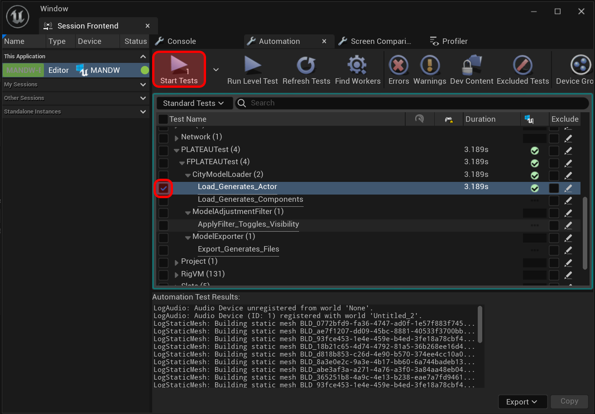

# UnitTestの追加方法

## 新規テストBP追加
### １．Blueprint Class作成メニューから親となるクラスにPLATEAUBaseTestを選択します。

 
 

### ２．出力するログファイル名を設定
String型の変数を作成しデフォルト値として、このテストが完了した時に出力するログファイル名を設定します。

 
 

### ３．Event Start Testを実装
Event Graphを開きEvent Start Testノードから必要な処理を実装します。 
* 既に出力されているログファイルを削除したい場合はDelete Test Resultを利用します。 
* InstancedCityModelを利用するテストの場合は親クラスのStart Test Eventを利用します。 
これにより、InstancedCityModelがシーンに存在する状態でテストを実行できます。 
既にInstancedCityModelがシーンに存在する場合は新たに生成しません。
* InstancedCityModelを利用しないテストの場合は４章で実装するRun Testをそのまま利用します。 

 
 

### ４．Run Testを実装
親クラスのRun TestをOverrideしてRun Testを実装します。親クラスのRun Testを呼ぶノードが自動生成されますが削除します。 
テストが成功した場合はSucceeded Testノードを最終ノードとして実行します。 
テストが失敗した場合はFailed Testノードを最終ノードとして実行します。

 

 
 

### ５．TestLevelを編集後、Session Frontendを確認
TestLevelに作成したテストBPをドラッグアンドドロップでレベルに配置します。 
Tools/Session Frontendを開きProject/Functional Tests以下を確認すると該当のテストが追加されています。 
表示されていなかった場合は上部メニューのRefresh Testsを実行します。

 

