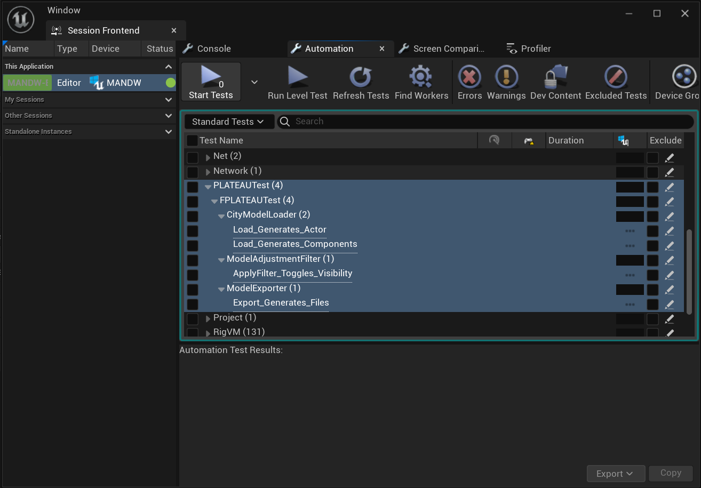

# UnitTestの追加方法

## 新規テスト追加
UnitTestフォルダ内に新しくcppファイルを追加します。既存のテストをコピーして利用することも可能です。 
`PLATEAU-SDK-for-Unreal-Dev/Plugins/PLATEAU-SDK-for-Unreal/Source/PLATEAUTests/Tests`

 

下記マクロの第三引数の文字列がテスト名になります。ドットで区切ることでエディタ上で階層表示できます。 
テスト名が長い場合はエディタ上で表示できないのでドットで区切ることをおすすめします。
<pre>
IMPLEMENT_CUSTOM_SIMPLE_AUTOMATION_TEST(FPLATEAUTest_CityModelLoader_Load_Generates_Actor, FPLATEAUAutomationTestBase,
                                        "PLATEAUTest.FPLATEAUTest.CityModelLoader.Load_Generates_Actor",
                                        EAutomationTestFlags::EditorContext | EAutomationTestFlags::EngineFilter)
</pre>
 
 

## エディタからの実行
`Tools/Session Frontend`を開き`PLEATEAUTest`以下を確認すると該当のテストが追加されています。 

 -->

 

実行したいテストにチェックを入れて上部メニューの`Start Tests`からテストを実行します。 
テスト完了後`PLATEAU-SDK-for-Unreal-Dev/TestLogs`に結果が出力されます。

 -->

 
 

## コマンドラインからの実行
### PowerShell

全ての`PLATEAUTest`以下のテストを実行
<pre>> & "C:\Program Files\Epic Games\UE_5.2\Engine\Binaries\Win64\UnrealEditor.exe" "xxx\PlateauUESDKDev.uproject" -ExecCmds="Automation RunTest PLATEAUTest; Quit" -log=PLATEAUTestLog.txt</pre>

 
 
特定のテストを実行
<pre>> & "C:\Program Files\Epic Games\UE_5.2\Engine\Binaries\Win64\UnrealEditor.exe" "xxx\PlateauUESDKDev.uproject" -ExecCmds="Automation RunTest PLATEAUTest.FPLATEAUTest.CityModelLoader.Load_Generates_Actor; Quit" -log=PLATEAUTestLog.txt</pre>

 

Unreal Editorを表示せずにテストを実行

<pre>> & "C:\Program Files\Epic Games\UE_5.2\Engine\Binaries\Win64\UnrealEditor.exe" "xxx\PlateauUESDKDev.uproject" -ExecCmds="Automation RunTest PLATEAUTest; Quit" -log=PLATEAUTestLog.txt -NullRHI</pre>
