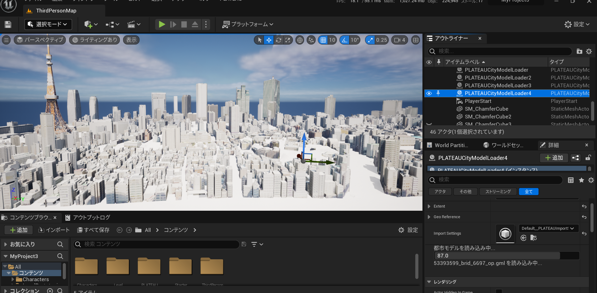

# PLATEAU SDK for Unreal

このパッケージには、[PLATEAU](https://www.mlit.go.jp/plateau/)の3D都市モデルデータを利用するためのAPI、サンプルが含まれます。PLATEAU SDK for Unrealを利用することで、実世界を舞台にしたアプリケーションの開発や、PLATEAUの豊富なデータを活用したシミュレーションを簡単に行うことができます。
  
