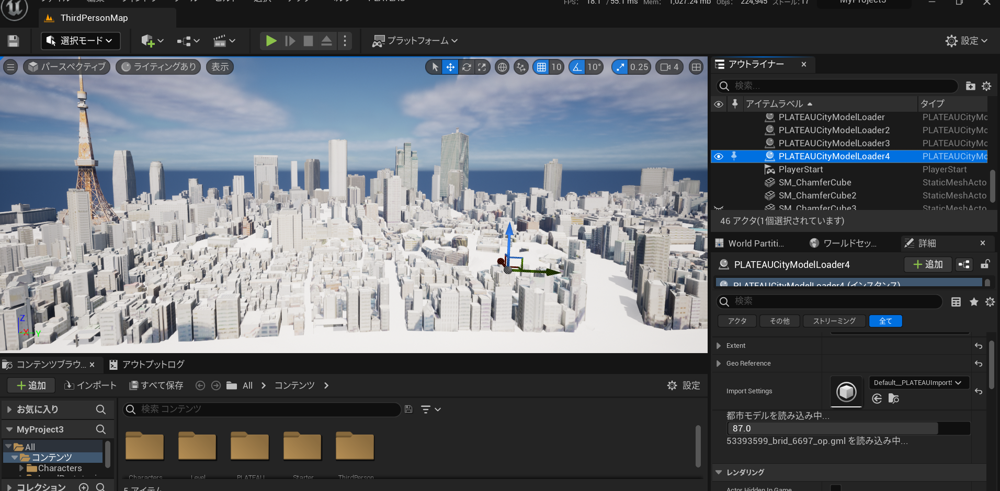
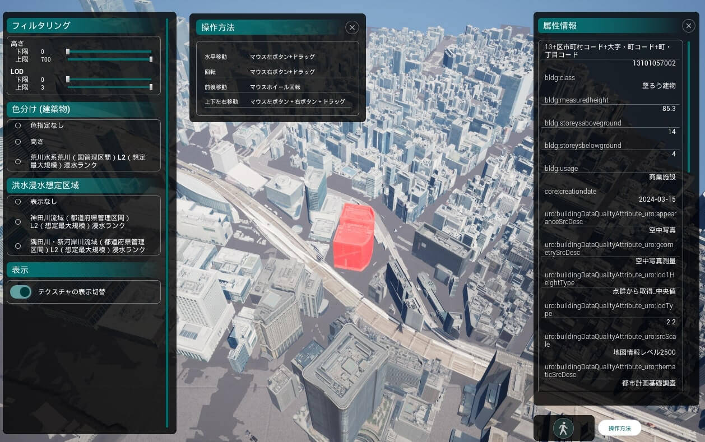
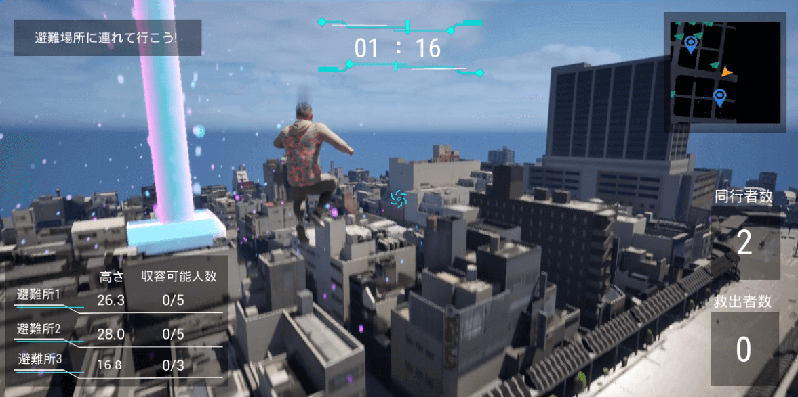
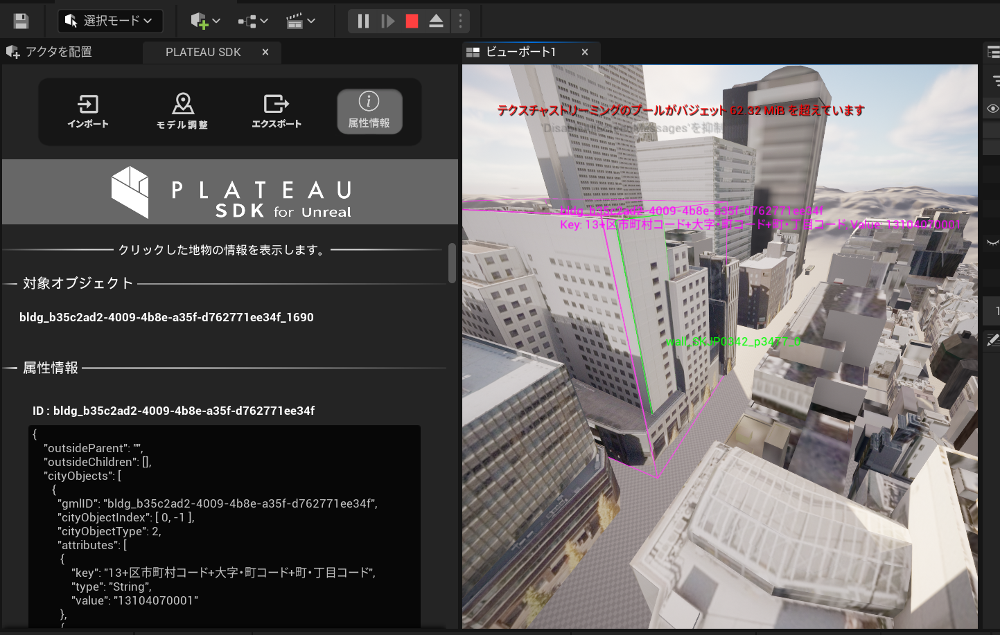
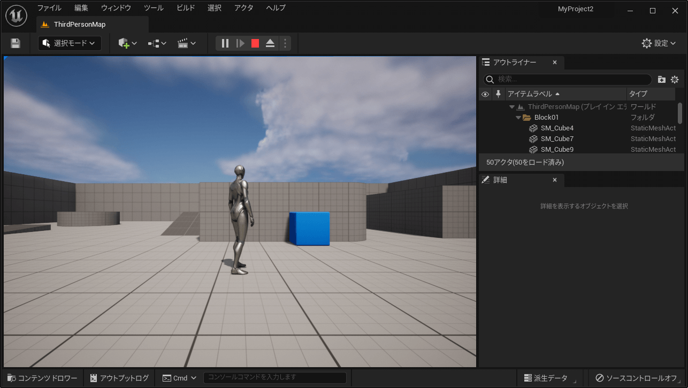

# PLATEAU SDK for Unreal

このパッケージには、[PLATEAU](https://www.mlit.go.jp/plateau/)の3D都市モデルデータを利用するためのAPI、サンプルが含まれます。PLATEAU SDK for Unrealを利用することで、実世界を舞台にしたアプリケーションの開発や、PLATEAUの豊富なデータを活用したシミュレーションを簡単に行うことができます。
  

## SDKでできることを知る  

都市データを使ったアプリやシミュレーションの例を下に示します。

- **[PLATEAU SDKを使ったGISサンプル](https://www.mlit.go.jp/plateau/learning/tpc17-2/#p17_6_1)**
  

- **[PLATEAU SDKを使ったゲームサンプル](https://github.com/Project-PLATEAU/PLATEAU-SDK-for-Unreal-GISSample)**
 

## SDK活用の実践編

PLATEAU SDK for Unreal を用いて実際にコンテンツを構築するチュートリアルをいくつかご紹介します。

### サンプルをカスタマイズして自分のデータに合わせてみよう

まずは用意されたサンプルを少し変更して、自分の都市データに合わせてみましょう。  
簡単な操作で建物に色を付けたり、クリックで情報を表示できるようになります。

 

- **[属性情報によって色分けする | PLATEAU SDK for Unreal](https://project-plateau.github.io/PLATEAU-SDK-for-Unreal/manual/ChangeColorByAttrs.html)**
- **[属性情報を表示する | PLATEAU SDK for Unreal](https://project-plateau.github.io/PLATEAU-SDK-for-Unreal/manual/AccessCityObject.html)**

### 3D都市モデル内を動くプロジェクトを作ってみよう

次のステップとして、実際に都市空間を利用したゲームを実際に構築してみましょう。  
キャラクターの移動や基本的な操作要素を追加することで、3D都市モデル内を歩き回るプロジェクトを実装できます。

 

- **[Unreal Engineで活用する[1/2]｜Unreal Engineで3D都市モデルを表示する](https://www.mlit.go.jp/plateau/learning/tpc10-1/)**
- **[Unreal Engineで活用する[2/2]｜3D都市モデル内を歩き回るプロジェクトの作成](https://www.mlit.go.jp/plateau/learning/tpc10-2/)**  

> [!NOTE]
> PLATEAU SDK for Unrealは利用者アンケートを実施しています。  
> 今後の開発の参考にするため、ユーザーの皆様の忌憚ないご意見をお聞かせください。  
> **[◆アンケートはこちら](https://docs.google.com/forms/d/e/1FAIpQLSeICxDJd6eQ311_rDbCudc2c8UUZ8A0oE6LXppKoHgT2mwYQQ/viewform)**

> [!NOTE]
> PLATEAU Slackコミュニティにどなたでもご参加いただけます。  
> 参加希望の方は、お問い合わせページよりお気軽にお問い合わせください。  
> **[◆お問い合わせページはこちら](https://www.mlit.go.jp/plateau/contact/)**