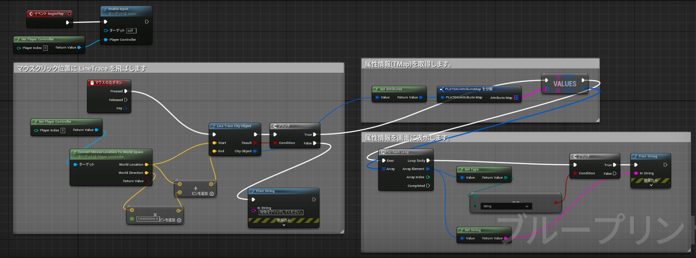
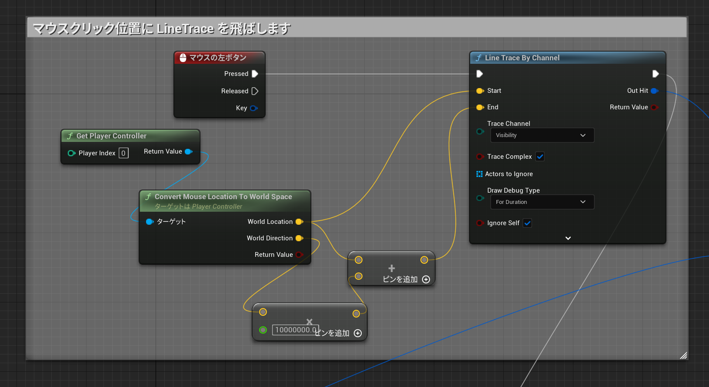
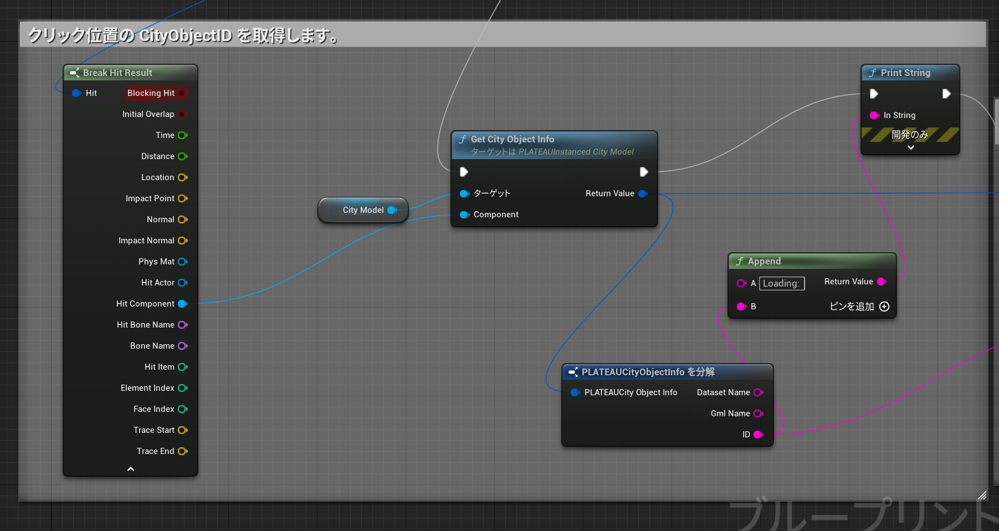
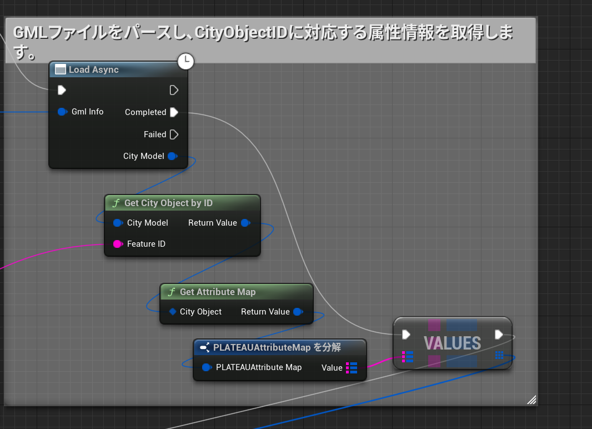
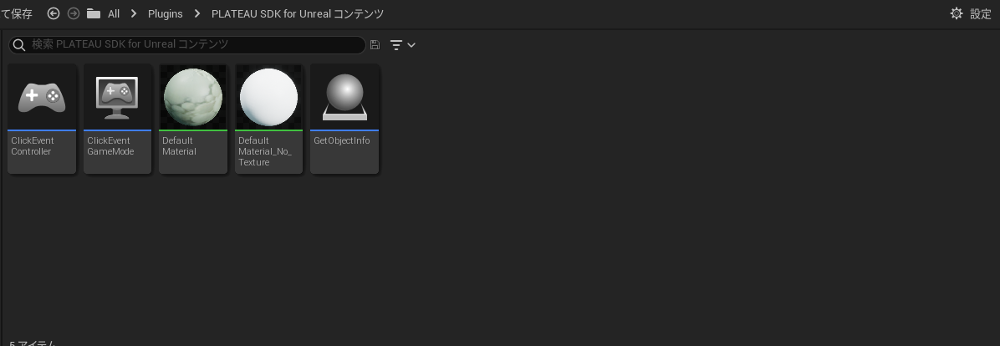
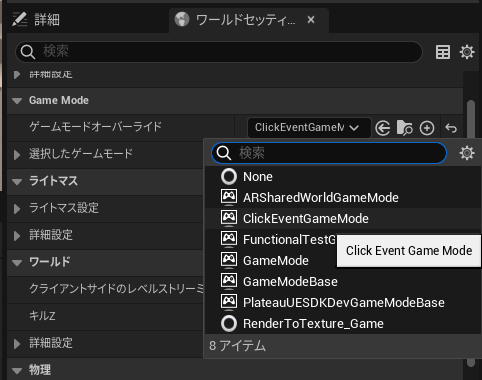

# 属性情報へのアクセス
このページではブループリントを利用して都市モデルの属性情報にアクセスする方法を記載します。

## 都市モデルのロード


サンプルとしてマウスをクリックした際にカメラの中心に位置する都市オブジェクトの属性情報を画面に表示するスクリプトを紹介します。

### コンストラクションスクリプト



#### クリックされたコンポーネントの取得



- `LineTraceByChannel`ノードによって画面中央にあるコンポーネントを取得します。

#### コンポーネントに対応する都市オブジェクトの取得



- `CityModel`変数には属性情報を取得したい`PLATEAUInstancedCityModel`アクタを設定します。
  - `PLATEAUInstancedCityModel`アクタは都市モデルをインポートすることによって生成されます。
- `GetCityObjectInfo`ノードは`USceneComponent`を受け取って都市オブジェクトにアクセスするために必要な情報を出力します。
- `LoadAsync`ノードは非同期でCityGMLのパースを行い、`CityModel`インスタンスを出力します。
- `GetCityObjectByID`ノードは`CityModel`インスタンスと`FeatureID`を受け取り、対応する`CityObject`インスタンスを出力します。

#### 都市オブジェクトの属性情報の可視化



- `GetAttributeMap`ノードは`CityObject`インスタンスを受け取り、都市オブジェクトが持つ属性情報を`AttributeMap`インスタンスとして出力します。

##　属性情報の取得方法



- コンテンツブラウザから`Plugin/PLATEAU SDK for Unrealコンテンツ`の`GetObjectInfo`をレベル上に配置します。


- `Plateau Instanceに配置した都市オブジェクトを指定し，`全て/入力/Auto Receive Input`を`Player 0`に指定します。 



- `ウィンドウ/ワールドセッティング`の`GameMode/ゲームモードオーバーライド`を`ClickEventGameMode`に指定します。

## 属性とは

都市オブジェクトの情報は「属性」として取得できます。  
属性は例えば  
  
```text
(String) 大字・町コード => 42,
(String) 防火及び準防火地域 => 準防火地域
```
  
のように、キーと値のペアからなる辞書形式の情報です。  
属性辞書は `CityObject.AttributesSet` メソッドで取得できます。  
`AttributesSet.ToString()` をコールすると、属性情報をすべて文字列にして返します。　　
`AttributesSet.GetValueOrNull("key")` によってキーに対応する`AttributeValue` を取得できます。  
`AttributeValue` の具体的な値は文字列型として取得できるか、または  
子の属性（属性は入れ子になることもあります）として取得できるかのいずれかです。  
属性が入れ子になっている例は次のとおりです。

```text
 (AttributeSet) 多摩水系多摩川、浅川、大栗川洪水浸水想定区域（想定最大規模） => 
    [ { (String) 浸水ランク => 2 }
    { (Measure) 浸水深 => 0.990 }
    { (Measure) 継続時間 => 0.68 }
    { (String) 規模 => L2 }  
]}
```

上の例において、(括弧)内の文字は属性の型を示します。  
属性値は次の型があります。:  
`AttributeSet, String, Double, Integer, Data, Uri, Measure`  
AttributeSet以外の型はすべて内部的には文字列型であり、  
`AttributeValue.AsString` で値を取得できます。  
入れ子AttributeSetの値は `AsString` ではなく `AttributeValue.AsAttrSet`で取得できます。  
属性値の型は `AttributeValue.Type` で取得でき、この値が `AttributeSet` である場合は　　
`AttributeValue.AsAttrSet`で子の `AttributesMap` を取得できます。  
`AttributeValue.Type` がそれ以外 (String, Doubleなど) である場合は `AttributeValue.AsString` で文字列を取得できます。
