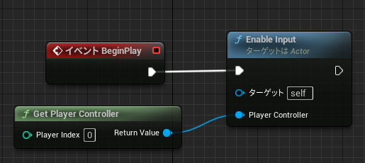

# 属性情報へのアクセス
このページではブループリントを利用して3D都市モデルの属性情報にアクセスする方法を記載します。

## 属性情報を確認する(PLATEAU SDKのエディタ機能)
SDK画面から各地物の属性情報を確認いただけます。

1. PLATEAU SDKウィンドウの「属性情報」タブを開きます。
2. `ウィンドウ/ワールドセッティング`の`GameMode/ゲームモードオーバーライド`を`ClickEventGameMode`に指定します。
    - PlayerControllerで左クリック入力を受け付けるように設定している場合はこの手順は行っていただく必要はありません。
3. レベルをプレイします。
4. 地物をクリックすると、その地物IDと属性情報が表示されます。

- ビュー上のピンク色の線は、選択中の主要地物の範囲を示します。
- ビュー上の緑色の線は、選択中の最小地物の範囲を示します。
- 地物IDがビュー中の文字で表示され、属性情報は属性情報ウィンドウのテキストボックスに表示されます。

### 主要地物と最小地物について
- 例えば、建物を主要地物単位でインポートした場合は、1つのComponentおよび1つのStaticMeshで1つの建物を表します。  
  その1つのメッシュを分解すると、「壁」「屋根」などのパーツになります。  
  この場合、建物全体が主要地物であり、壁、屋根などのパーツが最小地物に該当します。  
  ここで建物をクリックして属性情報を表示すると、主要地物（建物全体、1つのメッシュ）としての属性情報と、最小地物（壁や屋根など、メッシュの一部分）としての属性情報が両方表示されます。
- 建物を最小地物単位でインポートした場合、壁や屋根ごとにゲームオブジェクトおよびメッシュが分かれます。  
  この場合、最小地物ゲームオブジェクトの親ゲームオブジェクトから主要地物の情報を取得します。
- 建物を地域単位でインポートした場合、複数の主要地物が結合されます。  
  この場合、メッシュの一部分として主要地物および最小地物の情報を取得できます。

## 属性情報へアクセスするブループリント

> [!CAUTION]
> SDK画面を開いている状態では以下のスクリプトは動作しないため、SDK画面を閉じてから実行してください。

SDKにはサンプルのブループリントが含まれています。  
確認するには、コンテンツブラウザで `設定 → プラグインコンテンツを表示`　にチェックを入れ、次の場所にあるブループリントを開いてください：  
`Plugins/PLATEAU SDK for Unreal コンテンツ/Samples/AttributeLoadSample/ClickToGetAttribute`  
  
このブループリントを利用するには次のようにします：
- 都市モデルをインポートしたレベルに `ClickToGetAttribute` を配置します。  
- `ウィンドウ/ワールドセッティング`の`GameMode/ゲームモードオーバーライド`を`ClickEventGameMode`に指定します。
- 再生して都市オブジェクトをクリックすると属性情報が表示されます。

### ブループリントの説明

#### キー入力受付の有効化

- レベルの開始時に`EnableInput`関数を呼び出し、このBPがキー入力を受け取れるようにします。

#### クリックされた地物を取得する

- 左ボタンクリック時にカーソル位置にLineTraceを行い、クリックされた地物(CityObject)を取得します。
- LineTraceはSDKで提供している`LineTraceCityObject`関数を利用します。

#### 地物の属性情報を取得する

- 取得されたCityObjectの`GetAttributes`関数を呼び出し、属性情報のTMapを取得します。

#### 都市オブジェクトの属性情報の表示

- TMapから各属性情報値を取得し、`GetString`関数で文字列として内容を取り出します。
- `PrintString`関数で文字列を画面内に表示します。
