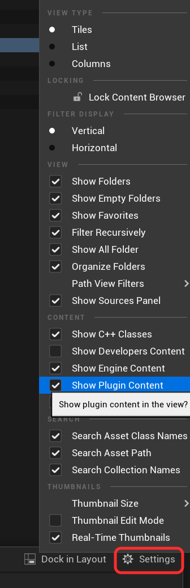
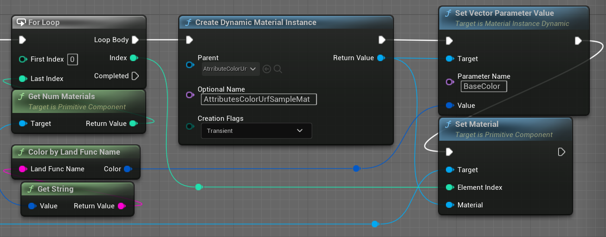
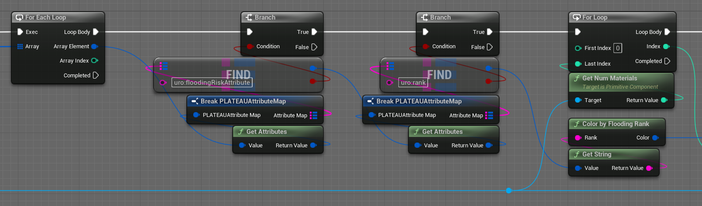

# 属性情報によって色分けする
<br>
上図は土地計画の区分を色分けするサンプルです。
<br>
<br>
<br>
上図は水害リスクを色分けするサンプルです。
<br>
<br>
このサンプルでは、土地計画決定情報および水害時の想定浸水高に関する属性情報を読み取り、それに応じてランタイムで色を変えます。
<br>
<br>

# サンプルBlueprintを開く

属性情報を読み取り、色を変えるBlueprintは次の場所にあります:<br>
```Plugins > PLATEAU SDK for Unreal Content > Samples > AttributesColorSample```


プラグインフォルダが表示されていない場合は設定からチェックボックスを入れることで表示できます。
<br>
<br>

<br>
<br>

# 土地計画の区分を色分けするサンプル

<br><br>

上のコードを解説します。<br>
属性情報を取得するには、まず各地物ゲームオブジェクトに対してインポート時に付与される```PLATEAUCityObjectGroupコンポーネント```にアクセスします。Outlinerで対象の```PlateauInstancedCityModel```を選択すると下図の用にコンポーネントがいくつも確認できます。土地計画区分で色分けするコンポーネントは```urf```という名前のコンポーネントであるため、BlueprintではObjectNameに```urf```を含む場合に処理をします。<br>

<br>

<br><br>

```PLATEAUCityObjectGroupコンポーネント```内には地物に関する情報が保存されています。
インポート時に地域単位に設定した場合、1つのコンポーネントの中に複数の地物情報(CityObject)が入っています。<br>
主要地物単位、または最小地物単位の場合はCityObjectは1つです。<br>
いくつであっても、```GetAllCityObjects```でCityObjectを取得できます。<br>

<br><br>

属性情報はキーとバリューのペアが集まったものです。<br>
バリューの型は、String型または入れ子のAttributesMap(キーバリューの組が集まったもの)のどちらかであり、対応するgetterで値を取得できます。なお、Double型など他の型のgetterもありますが、内部的には単にStringをパースしたものです。下図はString型の属性情報を取得する例です。

<br><br>

属性値に応じてマテリアルの```BaseColor```を変えることで、属性情報を可視化できます。

<br><br>

<br>
<br>

# 水害リスクを色分けするサンプル

<br><br>

上のコードを解説します。<br>
災害区分で色分けするコンポーネントはfldという名前のコンポーネントであるため、BlueprintではObjectNameに```fld```を含む場合に処理をします。<br>

<br><br>

fldの```PLATEAUCityObjectGroupコンポーネント```では属性情報が入れ子になっています。<br>
下図ではバリューがキーバリューセットの際に値を取得する例です。<br>
```uro:floodingRiskAttribute```をキーとする入れ子で、キー```uro:rank```の値を取得しています。

<br><br>

属性値に応じてマテリアルの```BaseColor```を変えることで、属性情報を可視化できます。

<br><br>
