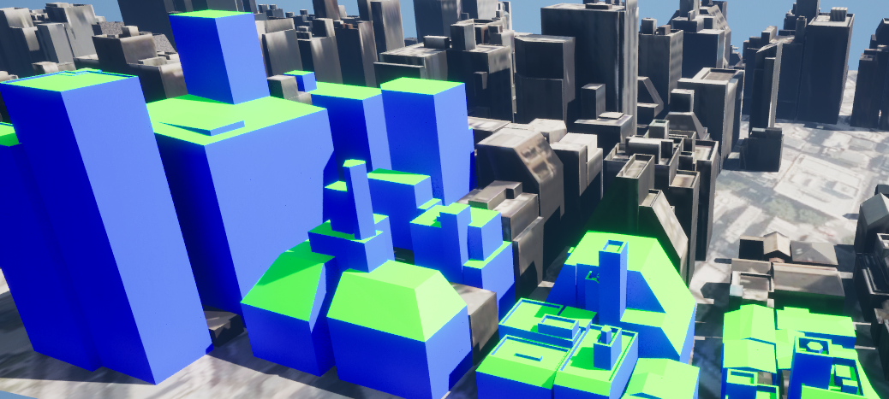

# マテリアル分け
このページではワールドに配置された3D都市モデルを都市オブジェクトのタイプごとにマテリアル分けする手順を説明します。

  

## 前提
ワールド内に3D都市モデルがインポートされていることが前提です。  
インポートの方法については [3D都市モデルのインポート](ImportCityModels.md) をご覧ください。  

## 結合・分離手順
### 結合・分離対象の指定
- メニューバーから `PLATEAU → PLATEAU SDK` を選択し、`モデル修正`から`マテリアル分け`を開きます。  
    
  
    
- マテリアル分け対象をアウトライナーから選択し、詳細パネルからコンポーネントを選択します。選択されたコンポーネントが選択オブジェクト項目に表示されます。
- マテリアル分類を指定して、検索ボタンを押します。
- 対象コンポーネントに含まれる地物型がリストアップされますので、変更したい地物の`マテリアルを変更する`にチェックを入れ、マテリアルを選択します。
- マテリアル分け完了後の地物単位を`粒度`プルダウンから選択します。
- 元のデータを残す場合は、`変換元を削除`のチェックを外します。
- `実行`ボタンを押すとマテリアル分け処理が開始されます。

>[!NOTE]
> **コンポーネント選択**  
> 選択対象コンポーネントは複数指定可能です。また階層となるコンポーネントの親コンポーネントを選択した場合子コンポーネントが全て選択対象となります。

