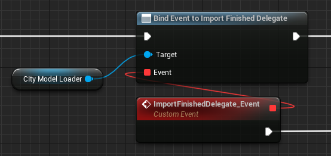

# エディタAPI
このページではブループリントで、エディタAPIを使用する方法を記載します。

## インポート
PLATEAU SDKウィンドウの`インポート`の機能をAPIにてご利用いただけます。

#### 準備
インポートを行うためにPLATEAUCityModelPackageをKeyとして、PackageInfoSettingsをValueとしたMapデータを作成します。

#### 特定の地物のみ読み込む場合のインポートデータ設定
インポートするPLATEAUCityModelPackageとPackageInfoSettingsをMapデータに格納します。
 - PackageInfoSettingsの各項目はの設定は、PLATEAU SDKウィンドウの`インポート`に対応しています。
	

#### 全ての地物を読み込む場合のインポートデータ設定
PLATEAU|BPLibraries|Util|GetAllCityModelPackagesにて全てのパッケージを取得し、Mapデータに格納します。
 - PackageInfoSettingsの各項目はの設定は、PLATEAU SDKウィンドウの`インポート`に対応しています。

#### ローカルからのインポート

1. PLATEAU|BPLibraries|ImportAPI|Get City Model Loader Localを配置します。
2. 参照するローカルのCityGMLまでのパスをSource Pathにセットします。
3. 読み込みたい地域のメッシュコードのArrayをMesh Codesにセットします。
4. 基準座標系の番号をZone IDにセットします。
5. オフセット値のx,y,zの値をVectorとしてReference Pointにセットします。
6. 上記で作成したPLATEAUCityModelPackageをKeyとして、PackageInfoSettingsをValueとしたMapデータをPackage Info Settings Dataにセットします。
7. Return ValueでPLATEAUCityModelLoaderを取得できます。

#### サーバーからのインポート

1. PLATEAU|BPLibraries|ImportAPI|Get City Model Loader Serverを配置します。
2. 接続先を上書きする場合は、In　Server URL, In Tokenの値をセットします。上書きしない場合は空欄にします。
3. Dataset IDをセットします。　
    - （取得方法は、以下のNOTEを参照してください。）
4. 読み込みたい地域のメッシュコードのArrayをMesh Codesにセットします。
5. 基準座標系の番号をZoneIDにセットします。
6. オフセット値のx,y,zの値をVectorとしてReference Pointにセットします。
7. 上記で作成したPLATEAUCityModelPackageをKeyとして、PackageInfoSettingsをValueとしたMapデータをPackage Info Settings Dataにセットします。
8. Return ValueでPLATEAUCityModelLoaderを取得できます。

>[!NOTE]
> **Dataset IDの取得**  
> PLATEAU SDKにてサーバからインポートを行いシーン上のPLATEAUCityModelLoaderを選択します。詳細パネルのSource項目がDataset IDに該当します。

#### ローカル・サーバー共通

1. Is Validを使用して、上記で取得したPLATEAUCityModelLoaderが利用可能かどうか確認します。
2. PLATEAUCityModelLoaderをTargetとしてPLATEAU|Load Modelを配置します。

>[!NOTE]
>Validでない場合、内部エラーが発生していますので、設定項目に間違いがないかご確認ください。

#### ロード完了通知

PLATEAUCityModelLoaderにImport Finished Delegate Eventをバインドすることで、ロード完了通知を受け取る事ができます。

#### ロードキャンセル

PLATEAUCityModelLoaderをTargetとしてPLATEAU|Cancelを配置することでロードをキャンセルする事ができます。

## エクスポート
PLATEAU SDKウィンドウの`エクスポート`の機能をAPIにてご利用いただけます。

1. エクスポートするModelを含むPLATEAUInstancedCityModelを取得します。
2. PLATEAU|BPLibraries|ExportAPI|Export Modelを配置し、Target City Modelに取得したPLATEAUInstancedCityModelをセットします。
3. PLATEAUMeshExportOptionsを配置し、各項目を設定し、Optionsにセットします。
    - 設定内容は、PLATEAU SDKウィンドウの`エクスポート`に対応しています。
4. 出力するフォルダーパスを Export Pathに設定します。

## ゲームオブジェクトON/OFF
PLATEAU SDKウィンドウの`ゲームオブジェクトON/OFF`の機能をAPIにてご利用いただけます。

1. フィルタするModelを含むPLATEAUInstancedCityModelを取得します。
2. PLATEAU|BPLibraries|ModelAdjustmentAPI|Filter Modelを配置し、Target City Modelに取得したPLATEAUInstancedCityModelをセットします。
3. 表示するパッケージ(EPLATEAUCityModelPackage)のArrayをEnablePackagesにセットします。
4. 表示する各パッケージ(EPLATEAUCityModelPackage)ごとのLOD(PLATEAUPackageLod)をパッケージをKey,LODをValueとしたMapにしてPackageToLodRangeMapにセットします。
5. 重複する地物を非表示にする場合は、OnlyMaxLodをTrueに設定します。
6. 表示するタイプ(EPLATEAUCityObjectsType)のArrayをEnableCityObjectsにセットします。

## 結合・分離
PLATEAU SDKウィンドウの`結合・分離`の機能をAPIにてご利用いただけます。

1. 結合・分離するModelを含むPLATEAUInstancedCityModelを取得します。
2. PLATEAU|BPLibraries|ReconstructAPI|Reconstruct Modelを配置し、Target City Modelに取得したPLATEAUInstancedCityModelをセットします。
3. 取得したPLATEAUInstancedCityModel内の結合・分離する各SceneComponentのArrayをTargetComponentsにセットします。
4. 結合・分離単位(EPLATEAUMeshGranularity)をReconstructTypeにセットします。
    - 地域単位:PerCityModelArea, 主要地物単位:PerPrimaryFeatureObject, 最小地物単位:PerAtomicFeatureObject
5. 変換元を削除する場合は、DestroyOriginalをTrueに設定します。

>[!NOTE]
> 上の例では、Convertタグをつけたコンポーネントのみを変換しています。

