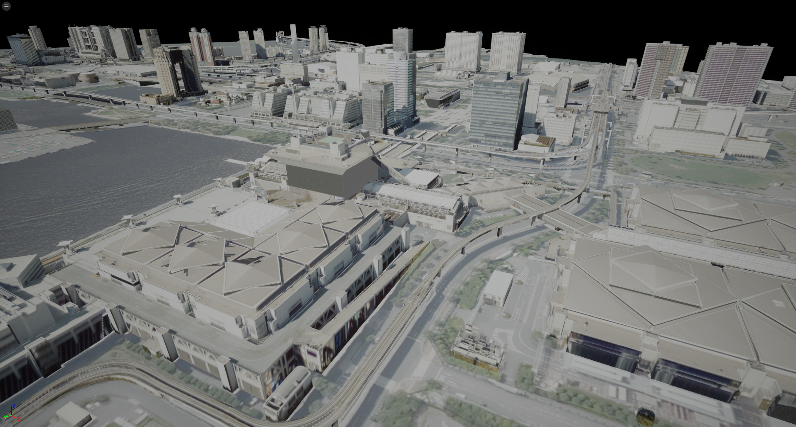
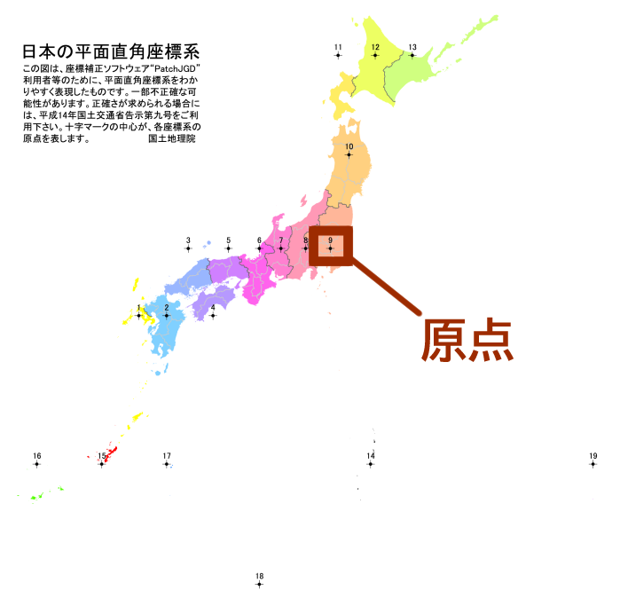

# 3D都市モデルのエクスポート
Unrealのレベルに配置された都市の3Dモデルを、objファイルや gltfファイルとしてエクスポートできます。  
このページではエクスポートの手順を説明します。  

## 前提
ワールド内に3D都市モデルがインポートされていることが前提です。  
インポートの方法については [3D都市モデルのインポート](ImportCityModels.md) をご覧ください。  

## エクスポート手順
### エクスポート対象の指定
- メニューバーから `PLATEAU → PLATEAU SDK` を選択します。  
  表示されるウィンドウの上部に4つのタブ「インポート、モデル修正、エクスポート、属性情報」があります。  
  このうちエクスポートを選択します。  

    
  
    
- エクスポート対象の選択
  エクスポート対象をアウトライナーから選択します。

  

  - 対象として選択できるのはインポート時に生成されたゲームオブジェクトのうち、  
    親子関係における最上位のものです。
  - 親子関係の最上位には自動で `PLATEAUInstancedCityModel` コンポーネントが付与されています。  
    このコンポーネントを持つゲームオブジェクトが選択対象となります。

### 出力オプションの設定

オプションの設定項目について説明します。
##### **出力形式**
- **OBJ**  
- **FBX**  
   **フォーマット**を次から選択します。
    お使いの用途に合わせて選択してください。
  - **バイナリ**
  - **ASCII**  
- **GLTF**  
   **フォーマット**を次から選択します。
  - **バイナリ**
    - 3Dモデルとその関連データをまとめて1つのファイルとするフォーマットです。
  - **ASCII**
    - 3Dモデル、テクスチャ、binファイルを別々のファイルとするフォーマットです。 
    
- **テクスチャを出力する**
  - 出力にテクスチャを含めるかどうかを設定します。チェックが付いていれば含みます。  

- `座標変換`
  - 座標の基準点を設定します。
  - `Local` (ローカル) のとき:
    - ポリゴンの座標は `PLATEAUInstancedCityModel` の位置を原点とした座標で表されます。  
      
      
  - `Plane Cartesian` (直交座標系) のとき: 
    - ポリゴンの座標は、国土交通省が定める直交座標系のうち、インポート時に選択した直交座標系を原点とするよう平行移動されます。  
        
      上図は [国土地理院のWebサイト「わかりやすい平面直角座標系」](https://www.gsi.go.jp/sokuchikijun/jpc.html) より引用  
      (原点マークは別途追記)
  - 2つの使い分けについて
    - 原点付近に3Dモデルが来るようにしたいときは Local
    - 原点から遠い位置に3Dモデルが配置されますが、複数の異なる都市をエクスポートするときに位置の整合性を取りたいときは Plane Cartesian が利用できます。
  
- **非表示モデルを出力する**
  - ヒエラルキー上で非表示になっているゲームオブジェクトを含めるかどうかを設定します。
  - チェックが外れているとき、非表示のものを出力から除外します。
  - ここでいう `非表示` とは、下図のチェックマークが自身または親において外れている状態を指します。  
  
  
- `座標系の設定`
  - Unrealではobj・fbxファイルはzが上向きの右手座標系として扱われるため
    エクスポートしたobj・fbxファイルをUnrealにインポートしたい場合は、 ENU を指定してください。  
    gltfの場合は、yが上向きの右手座標系として扱われるため WUN を指定し、インポート時にz軸を180度回転させてください。  
   **座標軸設定の趣旨:**
  - x,y,z 軸がどの方向を向いているかはアプリケーションによって異なりますが、  
    この設定項目によって座標軸の違いに合わせて変換できます。
  - 座標軸の名称はアルファベット3文字で表され、  
    (1文字目,2文字目,3文字目) が (x軸,y軸,z軸) の向きを表します。
  - 例えば、Unrealでは x軸が東(East), y軸が南(South), z軸が上(UP) を向くので、  
    頭文字をとって ESU が Unrealの座標系となります。
  - W は 西(West) を、N は 北(North) を表します。  

### エクスポートの実行
- 右端の`参照...`から出力先のフォルダを指定します。
- `モデルをエクスポート` ボタンを押してしばらく待ちます。
- 指定のフォルダに3Dモデルファイルが出力されます。

  
上図はエクスポートしたobjファイルを Blender で読み込んだものです。