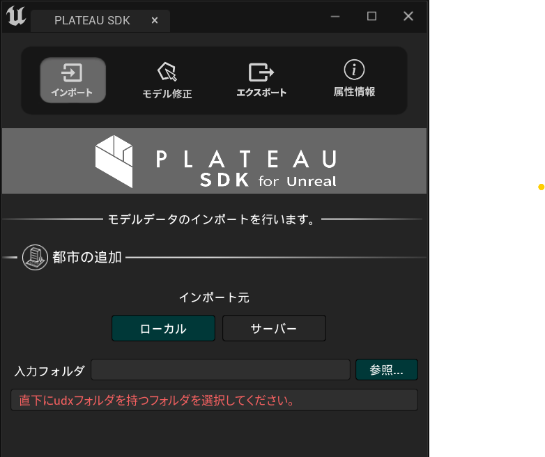
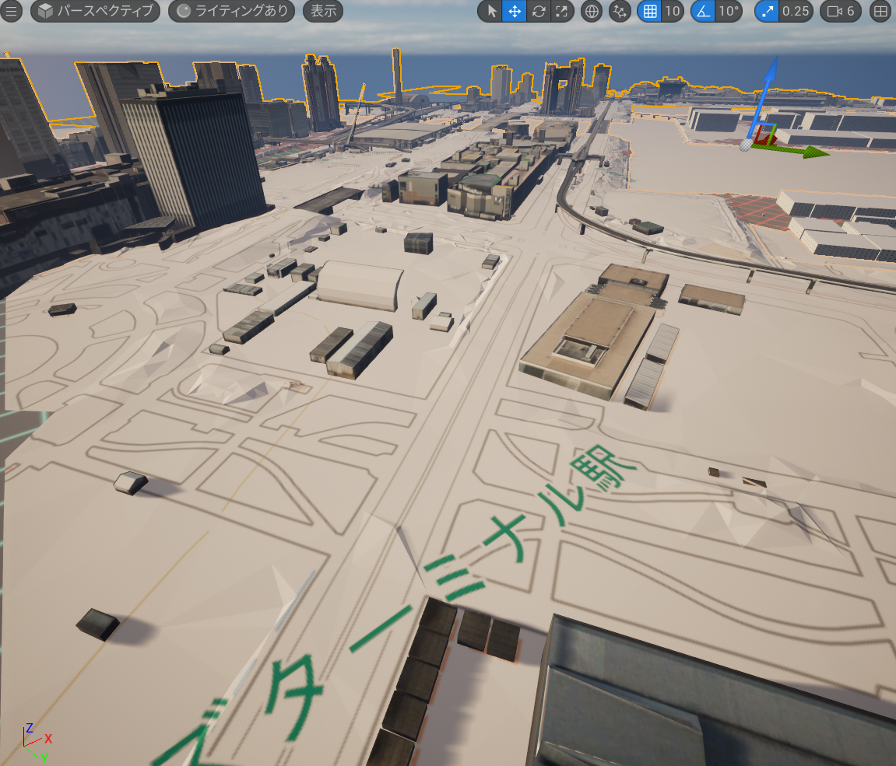
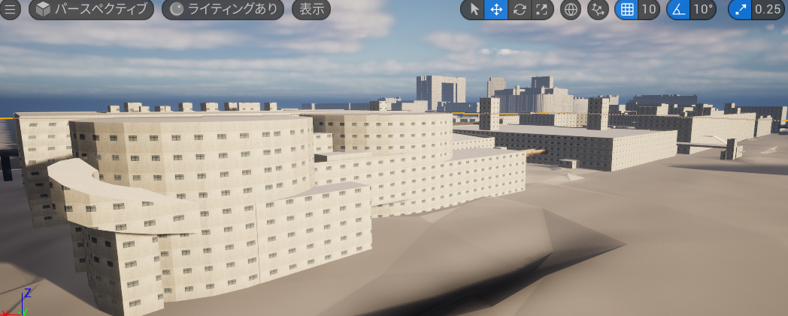

# 3D都市モデルのインポート

このページでは、都市データをUE5のプロジェクトにインポートする手順を説明します。

## 準備
- PLATEAU SDK for Unreal を導入したUE5プロジェクトを用意します。  
  SDKの導入方法は [インストール](Installation.md) を参照してください。

## インポート手順
### インポート元の選択
- Unreal Engineのメニューバーから `PLATEAU → PLATEAU SDK` を選択します。   
  表示されるウィンドウの上部に3つのタブ「インポート、モデル調整、エクスポート、属性情報」があります。  
  このうちインポートを選択します。

- インポート元で `ローカル` か `サーバー` を選択します。

#### ローカルからインポートする場合

- 導入したい都市データが自分のコンピュータにある場合はローカルを選択します。3D都市モデルは[G空間情報センターのPLATEAUポータルサイト](https://www.geospatial.jp/ckan/dataset/plateau)からダウンロードできます。
  - `参照`ボタンを押します。都市データのフォルダの選択画面が表示されます。
  - 都市データのフォルダの中には、`udx`,`codelists`という名前のフォルダがあるはずです。  
    `udx`から**階層が1つ上**のフォルダを選択します。

#### サーバーからインポートする場合

- `サーバー`では、PLATEAUのデータサーバーから直接3D都市モデルをインポートできます。
  - `接続先設定` の欄がありますが、設定しなくとも自動でデフォルトのURLに接続されます。  
    別のURLに接続したい場合のみ、URLを入力して「サーバーデータ更新」ボタンを押してください。  
    `トークン` は Bearer認証のトークンです。
  - `データセットの選択`で`都道府県`を選択します。
  - するとその都道府県に対応する `データセット`が選択肢に出てくるので選びます。

### 基準座標系の選択
リストのうち、都市が属する場所として近いものを選択します。  
   
適切なものを選ぶと座標の誤差が小さくなります。  
ここで選択する座標系は国土交通省が定める平面直角座標系に準拠しています。  
詳しくは [国土地理院のWebサイト「わかりやすい平面直角座標系」](https://www.gsi.go.jp/sokuchikijun/jpc.html) をご覧ください。

### インポート範囲の選択
- `範囲選択`ボタンを押すと範囲選択画面が開きます。
  
- 範囲選択画面の操作方法：
  - マウスホイールを上下に回してズームアウト、ズームインします。
  - マウスクリックしたままドラッグしてカメラ移動します。
  - 範囲の選択方法については、画面右下に説明があるとおり、
    - クリックで選択/選択解除
    - ドラッグで矩形での選択追加
    - Shift+ドラッグで矩形での選択除外をします。
  - 範囲がオレンジ色で表示されない場合は、見えるまでズームします。
  - ビューポート左上の決定ボタンを押して範囲を確定します。
- 画面のみかた：
  - 青色の線は利用可能な地域を示します。
  - 地域ごとに利用可能な地物種類とLODがアイコン形式で表示されます。(アイコンとして表示されない地物も一部存在します。)
    - 対応LODは色で表現されます。画面左下の凡例の色と対応します。
  - アイコンが多すぎると感じる場合は、画面左下の凡例のチェックを切り替えることでアイコンの表示/非表示をLODごとに切り替えることができます。
  - 地図は国土地理院のサイトから自動でダウンロードされて表示されます。インターネットへの接続が必要です。
  - 区域に表示される番号は、後述の`indexmap.pdf` に記載の番号と同じです。

**補足**:  
  地域の区分を確認したい時は、ローカルにダウンロードしたフォルダに付属している `indexmap` という名前のpdfファイルをご覧ください。  
下図のように地図上に区分が記載されています。
  

### 地物別設定
地物の種類ごとにインポートに関する設定を行います。  

**設定項目について:**  
- `一括設定`  
  - 全地物タイプの項目を一括で設定できます。  
  - `上図の設定例について`：
    - 建築物は「一括設定と同じ」のチェックが付いていないため個別に項目を設定できます。建築物の「インポートする」のチェックが付いていないのでインポートされません。
    - 道路は「一括設定と同じ」のチェックが付いているため一括設定の項目が設定されます。一括設定の「インポートする」のチェックが付いているのでインポートされます。  
- `インポートする`
  - チェックが付いている地物タイプのみインポートします。
- `テクスチャを含める`
  - テクスチャが存在する地物タイプで表示される設定項目です。  
    チェックが付いていて、かつテクスチャがある場合はそれを含めてインポートします。  
    都市データによってはテクスチャがない場合があり、  
    その場合はチェックを外した時と同様に真っ白な3Dモデルが出力されます。
- `テクスチャを結合する`
  - テクスチャを含める場合、テクスチャを結合するかしないかを設定します。

>[!NOTE]
> **テクスチャ結合すると描画負荷が良くなります**
>
> PLATEAUのデータはテクスチャの枚数が多い傾向にあり、  
> 結合しないと描画負荷が高くなる傾向にあります。
>
> 結合機能を有効にすると、複数のテクスチャを1枚の画像にまとめ、  
> 3DモデルのUVも合わせて調整されます。  
> それによって描画負荷を改善できます。
>
> 例えば、お台場の2km×2kmの建物について、  
> テクスチャ結合して4096×4096のテクスチャサイズにまとめたとき、  
> ドローコール数は2360から1960に向上しました。  

- `テクスチャ解像度`
  - テクスチャを結合する場合の、結合後のテクスチャの大きさを指定します。
- `最小LOD`, `最大LOD`
  - 複数のLODを利用可能な地物タイプで表示される設定項目です。

>[!NOTE]
> **LODとは**  
> gmlファイルの中には、3D都市モデルの形状の細かさを指定したいという需要に対応するため、  
> 複数の形状データが格納されている場合があります。  
> LOD0がもっとも大雑把な形状で、LOD1, LOD2 と数字が上がるほど細かい形状になります。  
> 建築物の場合、LOD0 は平面、LOD1は平面に一定の高さを付けたもの、LOD2はより細かい形状です。 
>   
> なお、ここでいう LOD とは PLATEAU の仕様上の LOD を指します。  
> Unreal Engine の機能としての LOD とは異なる概念です。

- `モデル結合`
  - `主要地物単位（建築物,道路等）`
    - モデルのメッシュは建物ごとに結合されて出力されます。
    - 建物ごとに地物データを取得できるようにしたい場合はこちらを選択します。
  - `最小地物単位（壁面,屋根面等）`
    - 屋根、壁単位など非常に細かくオブジェクトを分けたい場合はこちらを選択します。
  - `地域単位`
    - モデルのメッシュは結合されて出力されます。
    - オブジェクト数を削減して軽量化できますが、建物ごとの地物データは取得不可になります。
    - メッシュの結合はある程度の大きさの範囲ごとに行われます。
- `デフォルトマテリアル`
  - PLATEAUの3Dモデルのうち、テクスチャやマテリアル指定がない箇所のマテリアルを指定します。
  - デフォルトでは、地物タイプに応じたマテリアルが指定されています。

>[!NOTE]
> **地物の選択について**  
> 地物の中にはインポートに時間がかかるものもあるのでご注意ください。  
> 例えば 土地起伏 はデータの範囲が 10km × 10km と非常に広く、  
> データ容量が重く処理に時間がかかるのでご注意ください。

### 土地に衛星写真や地図を貼り付ける

土地に衛星写真や地図を貼り付けることができます。

#### 設定方法
- 範囲選択画面で土地起伏の3Dモデルが存在する地域を選択すると、インポート設定に「起伏」が表示されます。
  
- 土地起伏では、上述の地物別設定に加えて土地起伏専用の設定項目があります。
- `衛星写真または地図を付与する`
  - チェックがONになっていると機能が有効化されます。
- `地図タイルURL`
  - 航空写真または地図の画像をダウンロードするためのURLです。
  - デフォルトでは地理院地図の航空写真のURLが入力されています。
  - このURLを変更すれば、航空写真だけでなく、国土地理院が提供している多種多様な地図や写真を土地に貼り付けることができます。  
    利用できる地図については[国土地理院のページ](https://maps.gsi.go.jp/development/ichiran.html)を参照してください。  
    そのページに記載されているURLを貼り付けることで地図を利用できます。
  - 下図は地図を貼り付けた例です。
    
  - 下図は陰影起伏図を貼り付けた例です。
    
  - URLには文字列 `{z}, {x}, {y}`を含めるようにしてください。これは地図タイルのxyz座標に変換されます。
    - 地図タイルのxyz座標については[国土地理院のページ](https://maps.gsi.go.jp/development/siyou.html)を参照してください。
    - SDKの機能により、土地の座標をもとに文字列`{z}, {x}, {y}`を適切な数値に置き換えて画像をダウンロードします。
  - `ズームレベル`
    - 地図タイルのズームレベルです。
      - 数値が大きいほど高精細な画像になります。
      - 数値が1つ下がると、画素数が4分の1になります。
      - ズームレベルは、地図タイルxyz座標のzの値に相当します。
  - `利用可能なズームレベルの検索`
    - ボタンを押すと、現在入力されているURLでどのズームレベルが利用可能なのかを検索します。
    - 検索が完了すると、ズームレベルのドロップダウンの選択肢が変化し、利用可能なズームレベルから選択できるようになります。
      

この機能でダウンロードされた地図タイルは、自動で1枚の画像に結合され、土地のUVとマテリアルが設定されてインポートされます。

### 基準座標系からのオフセット値の設定
3Dモデルの原点をどこに置くかを指定します。  
デフォルト値として、選択範囲の中心位置が自動入力されるので、  
このままの値でインポート可能です。  
3Dモデルの原点位置を調整したい場合のみ値を編集してください。　　
 

**値の意味:**  
上のインポート設定で選択した「基準座標系」の原点から、  
東西・南北・高さ方向にそれぞれ何メートルの地点を3Dモデルの原点とするかを表します。  
基準座標系の原点は次の国土地理院のWebサイトで示されます:  
[国土地理院のサイト](https://www.gsi.go.jp/sokuchikijun/jpc.html)

### インポートの実行
- `モデルをインポート`ボタンを押します。
- 処理が進むと、都市のオブジェクトが順次シーンに配置されていきます。  
  進捗表示がすべて「完了」になったらインポート終了です。  

### インポートのキャンセル
- インポート処理中に`インポートをキャンセルする`ボタンを押します。
- キャンセル処理中は、ボタンが`キャンセル中…`の表記に変わります。
  再度`モデルをインポート`ボタンが表示されたらキャンセル完了です。

### 読み込み状況の確認
PLATEAUCityModelLoaderアクタの詳細パネルから読み込み状況の確認ができます。

### 原点情報の確認
インポートした3D都市モデルは原点付近に位置するようにオフセットがかけられます。  
原点情報はPLATEAUInstancedCityModelアクタの詳細パネルから確認が可能です。

### デフォルトマテリアルの見た目を変えたいとき
PLATEAU SDKでは地物タイプごとにデフォルトマテリアルが用意されています。  
例えば、下図の建物には建築物のデフォルトマテリアルが適用されています。

このマテリアルは独自のTriplanarマテリアルを利用しているため、UVのない地物にもテクスチャを投影できます。  
PLATEAUのモデルにはUVが**ない**場合があります。  
そのため、ご自分で見た目をカスタマイズする場合でも、SDK付属のTriplanar系マテリアル、またはそれと同様のTriplanar機能を有したマテリアルを利用することを推奨します。  
以下に同マテリアルをもとにしたマテリアルの作成方法を説明します。
#### SDK付属のマテリアルについて
PLATEAU SDKのデフォルトマテリアルは、以下の3種類のマテリアルを元に作られています。  
どれもUVなしでテクスチャを投影できるのが特徴です。
- `通常のTriplanarマテリアル`
- `デュアルテクスチャのTriplanarマテリアル`
  - 上下を向いた面と横を向いた面で異なる見た目を表現するTriplanarマテリアルです。
  - 利用例：建築物の上を向いた面をコンクリートの屋根に、側面を窓付きの壁にしたい場合などに利用できます。

このマテリアルを元にして別のマテリアルを作成する手順は次のとおりです：

- コンテンツブラウザで`Plugins/PLATEAU SDK for Unreal コンテンツ/Materials/Fallback`を開きます。
- ベースとしたいマテリアルを右クリックし、「マテリアルインスタンスを作成」します。
  - `PlateauDefaultBuildingMaterial`を元にした場合はデュアルテクスチャのTriplanarになります。
  - それ以外のデフォルトマテリアルを元にした場合は通常のTriplanarになります。
- マテリアルにテクスチャを割り当て、設定します。設定項目は次のとおりです：
  - `MainTexture` : メインのテクスチャです。
  - `NormalMap` : ノーマルマップです。
  - `NormalMapStrength` : ノーマルマップの強さです。
  - `Tiling` : テクスチャをタイリングさせる大きさです。
  - `Blend` : ポリゴンの向きに応じてテクスチャをブレンドさせる程度です。
  - `Metallic` : メタリック（金属感の強さ）です。
  - `MetallicTexture` : メタリックを表現するテクスチャです。
  - `Roughness` : ラフネス（ざらざら感の強さ）です。
  - `RoughnessTexture` : ラフネスを表現する強さです。
  - `AmbientOcclusion` : アンビエントオクルージョン(環境光の影響を受ける程度)です。
  - `AmbientOcclusionTex` : アンビエントオクルージョンを表現するテクスチャです。
  - `EmissionColor` : エミッション（発光）の色です。
  - `EmissionTexture` : エミッションを表現するテクスチャです。
  - `Opacity` : 不透明度です。 

デュアルテクスチャでは、上記の設定値がそれぞれ`Top`と`Side`の2つに分かれます。Topは上下面、Sideは側面の見た目を設定します。

- 自作したマテリアルは、インポート後にドラッグ＆ドロップ等で適用できるほか、インポートの設定項目として「デフォルトマテリアル」に指定できます。