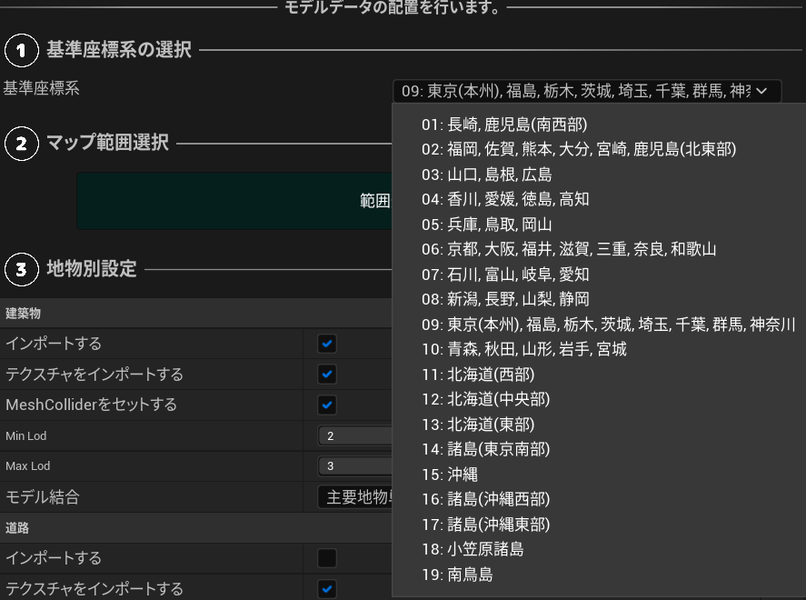
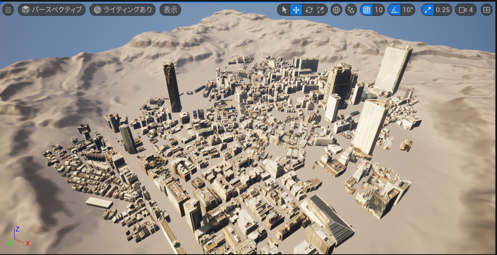

# 都市モデルのインポート

このページでは、都市データをUE5のプロジェクトにインポートする手順を説明します。

## 準備
- PLATEAU SDK for Unreal を導入したUE5プロジェクトを用意します。  
  SDKの導入方法は [インストール](Installation.md) を参照してください。

## インポート手順
### インポート元の選択
- Unreal Engineのメニューバーから `PLATEAU → PLATEAU SDK` を選択します。   
  表示されるウィンドウの上部に3つのタブ「インポート、モデル調整、エクスポート」があります。  
  このうちインポートを選択します。

- インポート元で `ローカル` か `サーバー` を選択します。

#### ローカルからインポートする場合

- 導入したい都市データが自分のコンピュータにある場合はローカルを選択します。3D都市モデルは[G空間情報センターのPLATEAUポータルサイト](https://www.geospatial.jp/ckan/dataset/plateau)からダウンロードできます。
  - `参照`ボタンを押します。都市データのフォルダの選択画面が表示されます。
  - 都市データのフォルダの中には、`udx`,`codelists`という名前のフォルダがあるはずです。  
    `udx`から**階層が1つ上**のフォルダを選択します。

#### サーバーからインポートする場合

- `サーバー`では、PLATEAUのデータサーバーから直接3D都市モデルをインポートできます。
  - `接続先設定` の欄がありますが、設定しなくとも自動でデフォルトのURLに接続されます。  
    別のURLに接続したい場合のみ、URLを入力して「サーバーデータ更新」ボタンを押してください。  
    `トークン` は Bearer認証のトークンです。
  - `データセットの選択`で`都道府県`を選択します。
  - するとその都道府県に対応する `データセット`が選択肢に出てくるので選びます。

### 基準座標系の選択
リストのうち、都市が属する場所として近いものを選択します。  
   
適切なものを選ぶと座標の誤差が小さくなります。  
ここで選択する座標系は国土交通省が定める平面直角座標系に準拠しています。  
詳しくは [国土地理院のWebサイト「わかりやすい平面直角座標系」](https://www.gsi.go.jp/sokuchikijun/jpc.html) をご覧ください。

### インポート範囲の選択
- `範囲選択`ボタンを押すと範囲選択画面が開きます。
  
- 範囲選択画面の操作方法：
  - マウスホイールを上下に回してズームアウト、ズームインします。
  - マウスクリックしたままドラッグしてカメラ移動します。
  - オレンジ色の球体をドラッグして範囲を選択します。
  - ビューポート左上の決定ボタンを押して範囲を確定します。
- 画面のみかた：
  - 青色の線は利用可能な地域を示します。
  - 地域ごとに利用可能な地物種類とLODがアイコン形式で表示されます。(地形、災害リスクなど、アイコンとして表示されない地物も一部存在します。)
  - 地図は国土地理院のサイトから自動でダウンロードされて表示されます。インターネットへの接続が必要です。

**補足**:  
  地域の区分を確認したい時は、ローカルにダウンロードしたフォルダに付属している `indexmap` という名前のpdfファイルをご覧ください。  
下図のように地図上に区分が記載されています。
  

### 地物別設定
地物の種類ごとにインポートに関する設定を行います。  
  
**設定項目について:**
- `インポートする`
  - チェックが付いている地物タイプのみインポートします。
- `テクスチャを含める`
  - テクスチャが存在する地物タイプで表示される設定項目です。  
    チェックが付いていて、かつテクスチャがある場合はそれを含めてインポートします。  
    都市データによってはテクスチャがない場合があり、  
    その場合はチェックを外した時と同様に真っ白な3Dモデルが出力されます。
- `最小LOD`, `最大LOD`
  - 複数のLODを利用可能な地物タイプで表示される設定項目です。

>[!NOTE]
> **LODとは**  
> gmlファイルの中には、都市モデルの形状の細かさを指定したいという需要に対応するため、  
> 複数の形状データが格納されている場合があります。  
> LOD0がもっとも大雑把な形状で、LOD1, LOD2 と数字が上がるほど細かい形状になります。  
> 建築物の場合、LOD0 は平面、LOD1は平面に一定の高さを付けたもの、LOD2はより細かい形状です。

- `モデル結合`
  - `主要地物単位（建築物,道路等）`
    - モデルのメッシュは建物ごとに結合されて出力されます。
    - 建物ごとに地物データを取得できるようにしたい場合はこちらを選択します。
  - `最小地物単位（壁面,屋根面等）`
    - 屋根、壁単位など非常に細かくオブジェクトを分けたい場合はこちらを選択します。
  - `地域単位`
    - モデルのメッシュは結合されて出力されます。
    - オブジェクト数を削減して軽量化できますが、建物ごとの地物データは取得不可になります。
    - メッシュの結合はある程度の大きさの範囲ごとに行われます。

>[!NOTE]
> **地物の選択について**  
> 地物の中にはインポートに時間がかかるものもあるのでご注意ください。  
> 例えば 土地起伏 はデータの範囲が 10km × 10km と非常に広く、  
> データ容量が重く処理に時間がかかるのでご注意ください。

### 基準座標系からのオフセット値の設定
3Dモデルの原点をどこに置くかを指定します。  
デフォルト値として、選択範囲の中心位置が自動入力されるので、  
このままの値でインポート可能です。  
3Dモデルの原点位置を調整したい場合のみ値を編集してください。　　
 

**値の意味:**  
上のインポート設定で選択した「基準座標系」の原点から、  
東西・南北・高さ方向にそれぞれ何メートルの地点を3Dモデルの原点とするかを表します。  
基準座標系の原点は次の国土地理院のWebサイトで示されます:  
[国土地理院のサイト](https://www.gsi.go.jp/sokuchikijun/jpc.html)

### インポートの実行
- `モデルをインポート`ボタンを押します。
- 処理が進むと、都市のオブジェクトが順次シーンに配置されていきます。  
  進捗表示がすべて「完了」になったらインポート終了です。  

### インポートのキャンセル
- インポート処理中に`インポートをキャンセルする`ボタンを押します。
- キャンセル処理中は、ボタンが`キャンセル中…`の表記に変わります。
  再度`モデルをインポート`ボタンが表示されたらキャンセル完了です。

### 読み込み状況の確認
PLATEAUCityModelLoaderアクタの詳細パネルから読み込み状況の確認ができます。

### 原点情報の確認
インポートした都市モデルは原点付近に位置するようにオフセットがかけられます。  
原点情報はPLATEAUInstancedCityModelアクタの詳細パネルから確認が可能です。

