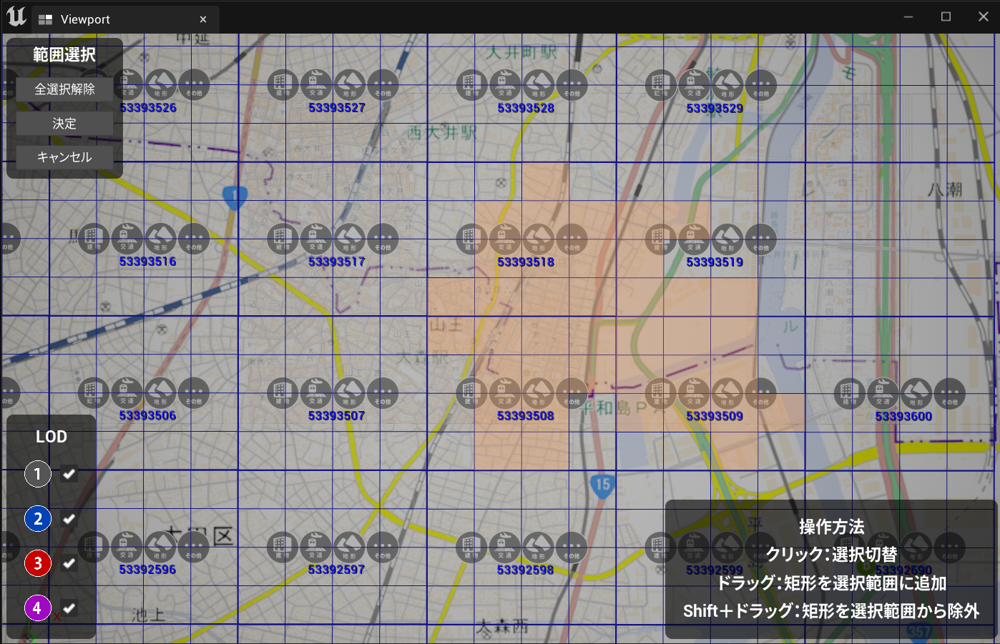
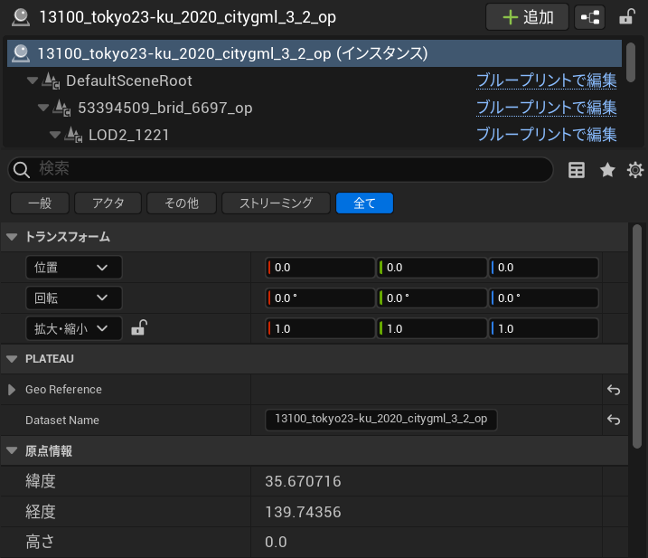

# 都市モデルのインポート

このページでは、都市データをUE5のプロジェクトにインポートする手順を説明します。

## 準備
- PLATEAU SDK for Unreal を導入したUE5プロジェクトを用意します。  
  SDKの導入方法は [インストール](Installation.md) を参照してください。

## インポート手順
### インポート元の選択
- Unreal Engineのメニューバーから ```PLATEAU → PLATEAU SDK``` を選択します。   
  表示されるウィンドウの上部に3つのタブ「インポート、モデル調整、エクスポート」があります。  
  このうちインポートを選択します。

- インポート先がローカルかサーバーかを選択します。
  - 導入したい都市データが自分のコンピュータにある場合はローカルを選択します。  3D都市モデルはG空間情報センターのPLATEAUポータルサイトからダウンロードできます。
    - ```参照```ボタンを押します。都市データのフォルダの選択画面が表示されます。
    - 都市データのフォルダの中には、```udx```,```codelists```という名前のフォルダがあるはずです。  
      ```udx```の**1つ上**のフォルダを選択します。
  - ```サーバー```では、ローカルの代わりにPLATEAUのデータサーバーから都市データをインポートできます。
    - この機能は未実装です。

### 基準座標系の選択
リストのうち、都市が属する場所として近いものを選択します。  
   
適切なものを選ぶと座標の誤差が小さくなります。  
ここで選択する座標系は国土交通省が定める平面直角座標系に準拠しています。  
詳しくは [国土地理院のWebサイト「わかりやすい平面直角座標系」](https://www.gsi.go.jp/sokuchikijun/jpc.html) をご覧ください。

### インポート範囲の選択
- ```範囲選択```ボタンを押します。
- 利用可能な範囲の一覧が緑色の線で表示されます。
  
- 青色のハンドルをドラッグして範囲を選択します。
- シーンビュー左上の```決定```ボタンを押します。
- **補足**:  
  地域の区分を確認したい時は、ローカルにダウンロードしたフォルダに付属している ```indexmap``` という名前のpdfファイルをご覧ください。  
下図のように地図上に区分が記載されています。
  

### 地物別設定
地物の種類ごとにインポートに関する設定を行います。  
  
**設定項目について:**
- ```インポートする```
  - チェックが付いている地物タイプのみインポートします。
- ```テクスチャを含める```
  - テクスチャが存在する地物タイプで表示される設定項目です。  
    チェックが付いていて、かつテクスチャがある場合はそれを含めてインポートします。  
    都市データによってはテクスチャがない場合があり、  
    その場合はチェックを外した時と同様に真っ白な3Dモデルが出力されます。
- ```最小LOD```, ```最大LOD```
  - 複数のLODを利用可能な地物タイプで表示される設定項目です。

>[!NOTE]
> **LODとは**  
> gmlファイルの中には、都市モデルの形状の細かさを指定したいという需要に対応するため、  
> 複数の形状データが格納されている場合があります。  
> LOD0がもっとも大雑把な形状で、LOD1, LOD2 と数字が上がるほど細かい形状になります。  
> 建築物の場合、LOD0 は平面、LOD1は平面に一定の高さを付けたもの、LOD2はより細かい形状です。

- ```モデル結合```
  - ```主要地物単位（建築物,道路等）```
    - モデルのメッシュは建物ごとに結合されて出力されます。
    - 建物ごとに地物データを取得できるようにしたい場合はこちらを選択します。
  - ```最小地物単位（壁面,屋根面等）```
    - 屋根、壁単位など非常に細かくオブジェクトを分けたい場合はこちらを選択します。
  - ```地域単位```
    - モデルのメッシュは結合されて出力されます。
    - オブジェクト数を削減して軽量化できますが、建物ごとの地物データは取得不可になります。
    - メッシュの結合はある程度の大きさの範囲ごとに行われます。

>[!NOTE]
> **地物の選択について**  
> 地物の中にはインポートに時間がかかるものもあるのでご注意ください。  
> 例えば 土地起伏 はデータの範囲が 10km × 10km と非常に広く、  
> データ容量が重く処理に時間がかかるのでご注意ください。
  
### インポートの実行
- ```モデルをインポート```ボタンを押します。
- 処理が進むと、都市のオブジェクトが順次シーンに配置されていきます。  
  進捗表示がすべて「完了」になったらインポート終了です。  


### 読み込み状況の確認
PLATEAUCityModelLoaderアクタの詳細パネルから読み込み状況の確認ができます。


### 原点情報の確認
インポートした都市モデルは原点付近に位置するようにオフセットがかけられます。  
原点情報はPLATEAUInstancedCityModelアクタの詳細パネルから確認が可能です。

