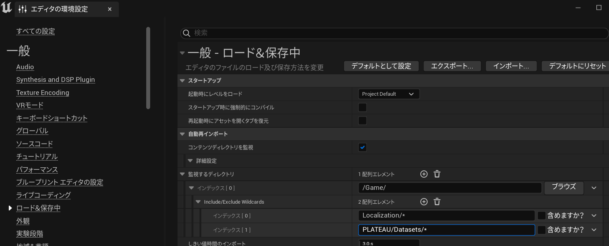

# インストール
## 対応Unrealバージョンのインストール
- Unreal Engineの対応バージョンについて、[リリースページ](https://github.com/Project-PLATEAU/PLATEAU-SDK-for-Unreal/releases) に記載のバージョンを利用してください。
  - [Epic Games Launcher](https://www.unrealengine.com/ja/download) から指定のバージョンをインストールできます。
- (Windowsの場合) Visual Studio の利用を想定しています。  
  - Visual Studio についても、[リリースページ](https://github.com/Project-PLATEAU/PLATEAU-SDK-for-Unreal/releases) に記載のバージョンを利用してください。
  - インストール時は、[こちらの手順に従って](https://docs.unrealengine.com/5.0/ja/setting-up-visual-studio-development-environment-for-cplusplus-projects-in-unreal-engine/) 追加のコンポーネントをインストールしてください。

## Unrealプロジェクトの作成
- 先ほどインストールしたバージョンを起動します。
- 適宜設定を行い`作成`を押します。

## PLATEAU SDK for Unrealの導入
 - [リリースページ](https://github.com/Project-PLATEAU/PLATEAU-SDK-for-Unreal/releases)から提供されている`PLATEAU-SDK-for-Unreal-{バージョン名}.zip`をダウンロードします。
 - 作成したプロジェクトのフォルダに`Plugins`という名前のフォルダを作成し、先程ダウンロードしたSDKを解凍しコピーします。
 - `Plugins/PLATEAU-SDK-for-Unreal/PLATEAU-SDK-for-Unreal.uplugin`が存在することを確認します。
 - プロジェクトを開きます。既にプロジェクトを開いている場合は一度閉じてから再度プロジェクトを開いてください。
 - プロジェクトを開く際に以下の画面が表示される場合は`はい`を押して完了です。

# エディタ設定の変更(推奨)
## 自動再インポート対象の除外
1. `エディタの環境設定`から`ロード＆保存中`→`監査するディレクトリ`→`インデックス[0]`を選択します。
2. 除外対象として`PLATEAU/Datasets/*`を追加します。

この操作を行わない場合、取得されたgmlファイル等の生データを手動でインポート対象から除外する必要があります。

## 距離スケーリング済みのカメラ速度を使用
1. `エディタの環境設定`から`距離スケーリング`で検索します。
2. `距離スケーリング済みのカメラ速度を使用`にチェックを入れます。

この操作を行うことで広域なマップでの操作性が向上します。