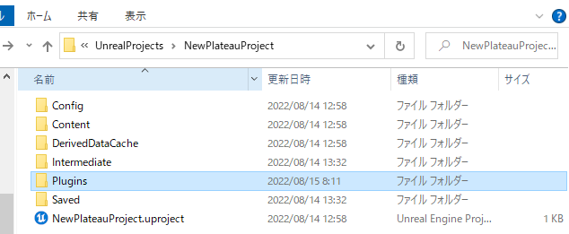

# インストール
## 対応Unrealバージョンのインストール
- PLATEAU SDK for UnrealはUE5での動作を想定しています。  
  UE5がインストールされていない場合は、以下URLからインストールしてください。
  - [Epic Games Launcher をこちらからインストールします](https://www.unrealengine.com/ja/download)。

## Unrealプロジェクトの作成
- 先ほどインストールしたバージョンを起動します。

- 適宜設定を行い```作成```を押します。


## PLATEAU SDK for Unreal の導入
 - [PLATEAU SDK for Unreal をこちらからダウンロードします。](https://github.com/Synesthesias/PlateauUESDK)。

 - 作成したプロジェクトのフォルダに```Plugins```という名前のフォルダを作成し、先程ダウンロードしたSDKをコピーします。

 - プロジェクトを開きます。既にプロジェクトを開いている場合は一度閉じてから再度プロジェクトを開いてください。
 - プロジェクトを開く際に以下の画面が表示されるので```はい```を押して完了です。
