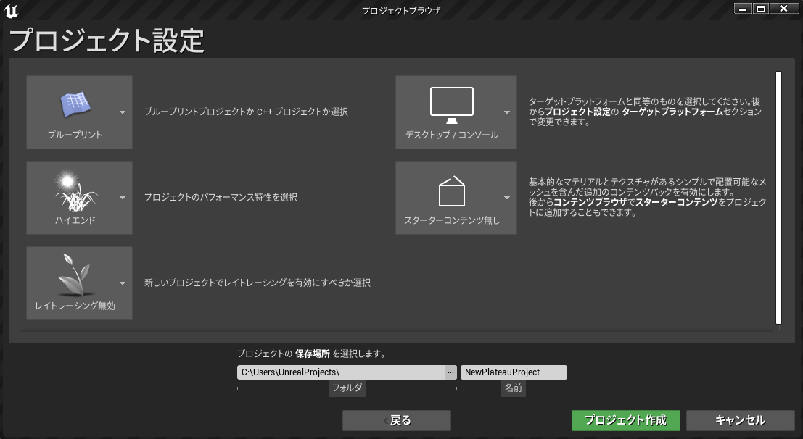

# インストール
## 対応Unrealバージョンのインストール
- PLATEAU UE SDK は、Unrealバージョン ```4.27``` を想定しています。  
  そのバージョンがインストールされていない場合は、次の手順でインストールしてください。
  - [Epic Games Launcher をこちらからインストールします](https://www.unrealengine.com/ja/download)。
  - Epic Games Launcherを起動し、左のサイドバーから```Unreal Engine``` → 上のメニューから```ライブラリ``` をクリックします。

  - ```Engineバージョン```の隣のプラスボタンをクリックしてバージョンを追加し、数字を選択して4.27 で始まるバージョンを選択し、```インストール```を押します。


## Unrealプロジェクトの作成
- 先ほどインストールしたバージョンを起動します。

- 新規プロジェクトの欄から```ゲーム```を選択し、```次へ```を押します。

- テンプレート選択で```blank```を選択し、```次へ```を押します。

- プロジェクト名と保存先を入力し```プロジェクト作成```を押します。


## PLATEAU UE SDK の導入
 - [PLATEAU UE SDK をこちらからダウンロードします](https://github.com/Synesthesias/PlateauUESDK)。

 - 作成したプロジェクトのフォルダに```Plugins```という名前のフォルダを作成し、先程ダウンロードしたSDKをコピーします。

 - プロジェクトを開く際に以下の画面が表示されるので```はい```を押して完了です。
