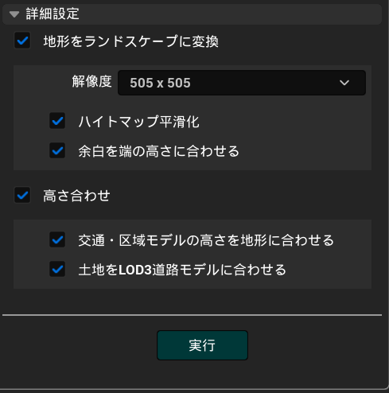

# 地形変換

## 概要

PLATEAUウィンドウの`地形変換`では、インポートした都市モデルの地形を変換できます。  
次の機能があります。
- 地形をランドスケープに変換
  - 地形モデルをUnrealのLandscapeに変換します。
- 高さ合わせ
  - インポートした道路、災害リスク、土地利用等対象の都市モデルを変換した地形に重なるよう調整します。

> [!NOTE]  
> 高さ合わせ対象となる都市モデルは次のパッケージタイプです。
> 「道路、災害リスク、土地利用、都市計画決定情報、徒歩道、広場、水部、交通(航路)」

### 操作画面の開き方

- Unrealのメニューバーから `PLATEAU` → `PLATEAU SDK` を選択します。
- ウィンドウ上部のタブのうち `地形変換` を選択します。

### できること

- `起伏`都市モデルをUnrealのLandscapeに変換できます。
- 道路、災害リスク、土地利用等の都市モデルを変換した地形に重なるよう調整します。

### 使い方

- `変換対象` には、`起伏`都市モデルを含む都市モデルを選択します。
  - そのヒエラルキーの子も対象となります。
- `オブジェクト配置`プルダウンを選択します。
  - `新規追加`は元のコンポーネントを非表示にし、そのまま残します。
  - `置き換える`は元のコンポーネントを削除します。
- `詳細設定`から更に細かい設定が行えます。
- `実行`ボタンを押すと地形をランドスケープに変換し、道路、災害リスク、土地利用等対象の都市モデルが変換した地形に重なるよう自動的に調整されます。

## 詳細設定

### 地形をランドスケープに変換機能
- `地形をランドスケープに変換`にチェックを入れると地形をランドスケープに変換し、更に詳細なオプションが有効になります。
  - `解像度`プルダウンから変換時にハイトマップとして利用する画像解像度を選択できます。
  - `ハイトマップ平滑化`にチェックを入れるとハイトマップにぼかしフィルタを適用し、よりスムーズな地形になります。
  - `余白を端の高さに合わせる`にチェックを入れるとハイトマップの余白を一番端のピクセルで埋めます。チェックが外れていると余白部分の高さは０になります。
  - 
### 高さ合わせ機能
- `高さ合わせ`にチェックを入れると高さ合わせの更に詳細なオプションが有効になります。
  - `交通・区域モデルの高さを地形に合わせる`にチェックをいれると道路、災害リスク、土地利用等の都市モデルを変換した地形に重なるよう調整します。

> [!CAUTION]
> 地形変換の機能を利用するためには、都市モデルインポート時に `起伏`を含めてインポートする必要があります。
