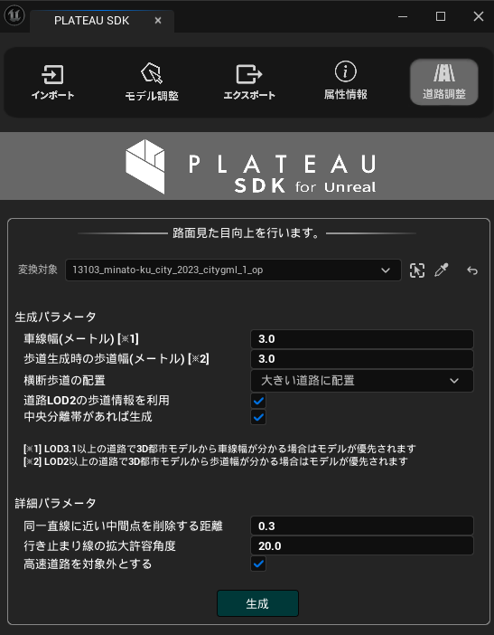

# 道路ネットワークの利用

インポートされた道路モデルから  
道路の見た目を向上できます。
このページでその機能を説明します。

## 道路ネットワーク機能の概要
道路ネットワークとは、道路の車道、歩道、交差点などのレーンと、それらのつながりを構造化したものです。

本機能では、道路メッシュの形状から道路の構造を推定し、ユーザーが入力したパラメーターに応じて、見た目の向上を行います。  
具体的には次の機能があります。
- 推定された車道形状を基に、道路に白線や停止線を引きます。
- 推定された歩道と車道に対して、それぞれ別のマテリアルを設定します。
  
自動生成される道路ネットワークは推定であり、現実の道路とは異なる場合があります。  

## 道路ネットワークの機能について
下図が道路ネットワーク機能に関する画面です。  
この画面を開くには、メニューバーの PLATEAU → PLATEAU SDKからウィンドウを開き、「道路調整」タブを開きます。  

### 「道路調整」画面
道路調整の画面では、インポート済みの道路モデルから道路ネットワークを自動で生成できます。  
「生成」ボタンをクリックしてしばらくすると道路ネットワークが生成されます。  
加えて、車道の白線や停止線、横断歩道、車線の矢印標示が生成され、見た目が良くなります。

ここでシーンに生成及び変換されるオブジェクトは次の通りです。
- インポートした都市モデル
  - 都市モデルの道路オブジェクトは、マテリアル分け機能によって車道用と歩道用のマテリアルが設定されます。
- `PLATEAUReproducedRoad`という名称のアクター
  - 生成された道路標示（白線、停止線など）がこのアクターのコンポーネントに設定されます。
  - コンポーネントの名称は、横断歩道であれば`LineGeneratorComponent_Crossing` 、白線であれば`LineGeneratorComponent_WhiteLine`、破線であれば`LineGeneratorComponent_DashedWhilteLine`、黄色の線であれば`LineGeneratorComponent_YellowLine`、停止線であれば`LineGeneratorComponent_StopLine`、車線の矢印であれば `LineGeneratorComponent_WhiteLine` となります。
- `PLATEAURnStructureModel`という名称のアクター
  - このアクターに道路ネットワークが格納されます。
  - アクターの `PLATEAU/Debug`項目では、`Visible`をオンにすることでPIE実行時に道路ネットワーク構造を可視化できます。
  - 可視化する種類、色などを同コンポーネントで設定できます。可視化時はPCの動作が重くなることがあります。
  - 下図はメインの`Visible`をオンにしたうえで、`Road Option`の`Visible`および`Lane Option`の`Visible`をオンにした場合の表示です。

道路ネットワーク生成時、すでに上記の生成ゲームオブジェクトが存在する場合は、古いものを置き換える形で生成します。  

道路ネットワーク生成の設定項目は次のとおりです。

- 生成パラメータ  
  - `車線幅（メートル）`：3D都市モデルの道路幅と車線幅を基準に車線が生成されます。車線数や形状に影響します。  
  - `歩道生成時の歩道幅`：歩道が生成可能な場合にこの幅を基準に歩道が生成されます。
  - `横断歩道の配置`：横断歩道を配置する条件を次から選びます。
    - `大きい道路に配置` : 道路の車線数が2以上、かつ長さが30m以上の道路に横断歩道を配置します。
    - `すべての交差点に配置` : すべての交差点に横断歩道を配置します。
    - `配置しない` : 横断歩道を配置しません。
  - `道路LOD2以上の歩道情報を利用`：LOD2以上の道路に歩道情報があれば、それを利用して歩道を生成します。LOD1しか無い場合は、チェックを外した場合と同様に推定により歩道を決めます。  
  - `中央分離帯があれば生成`：道路の属性情報として中央分離帯があり、それが1つのレーンを形成している場合に中央分離帯を作成します。   

- 詳細パラメータ   
  - `同一直線に近い中間点を削除する距離`：3つの頂点が同一直線上に並んでいるかを判断する閾値です。同一直線上にある際には中央の頂点は削除されます。  
  - `行き止まりの線の拡大許容角度`：行き止まりの末端線の検出において、道路の末端の線の曲がり角の総和がどの角度以内なら同一直線の行き止まりとみなすかです。行き止まり道路の末端と判別される線が実際より長くて側面まで延びている場合は小さい値に、末端の線が実際より短い場合は大きい値にすると良いです。  
  - `高速道路を対象外にする`：高速道路を自動生成の対象外にします。高速道路は、複雑な立体交差などの判別がうまくいかないことが多いためデフォルトで対象外となっています。  

### 仕組みについて

#### 歩道推定の仕組み
LOD1の道路の歩道を推定する仕組みを説明します。  
まずすべてを車道扱いで生成します。    
次に、パラメータで指定した歩道幅より太い道路の場合、車道を狭めて歩道を追加します。  
ただし、これにより車道幅が2m未満になる場合は歩道を生成しません。

#### 頂点の結合について
道路ネットワークの生成において、近くにある頂点は結合されたものとみなされます。  
その理由は、道路モデル上で繋がっているべき頂点が離れているケースに対応するため、  
および高速化のためになります。  
この処理の結果として、急激なUターンを伴うなど一部の箇所で道路形状が元から変わって生成される場合があります。
