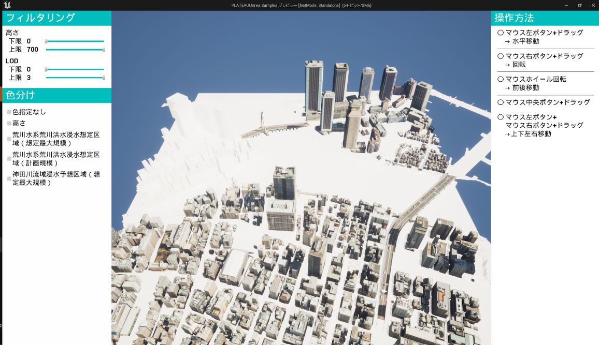

# PLATEAU SDK for Unreal
PLATEAU SDK for Unrealは、[PLATEAU](https://www.mlit.go.jp/plateau/)の3D都市モデルデータをUnreal Engine 5で扱うためのツールキットであり、主に以下の機能を提供しています。

- CityGMLの直感的なインポート
  - 地図上での範囲選択による3D都市モデルの抽出
  - PLATEAUのサーバーで提供されるCityGMLへのアクセス
  - 地形への航空写真の付与
  - テクスチャの自動結合
- 3D都市モデルに含まれる地物のフィルタリング
- 3D都市モデルの3Dファイル形式へのエクスポート
- 3D都市モデルの属性にアクセスするためのBlueprint API
- 3D都市モデルに含まれる地物の分割・結合
- 地物型によるマテリアル分割

PLATEAU SDK for Unrealを利用することで、実世界を舞台にしたアプリケーションの開発や、PLATEAUの豊富なデータを活用したシミュレーションを簡単に行うことができます。

# サンプルプロジェクト
本SDKを使用して作成されたサンプルプロジェクトを[こちら](https://github.com/Project-PLATEAU/PLATEAU-SDK-for-Unreal-Samples)で配布しています。

&nbsp;
&nbsp;

# 動作環境

**OS**
- Windows（x86_64）
- MacOS（ARM）
- Android、iOS
  - モバイル向けには、一部の機能のみ（緯度経度と直交座標の相互変換など）をサポートしています。  

**開発環境**
- Unreal Engine, および (Windowsの場合) Visual Studio のバージョンについては、  
  [Releaseページ](https://github.com/Project-PLATEAU/PLATEAU-SDK-for-Unreal/releases) に記載のものを利用してください。

# 利用手順
- SDKの最新版は[Releaseページ](https://github.com/Project-PLATEAU/PLATEAU-SDK-for-Unreal/releases)からダウンロードしてください。
- 詳しい利用方法については、こちらの [マニュアル](https://Project-PLATEAU.github.io/PLATEAU-SDK-for-Unreal/index.html) をご覧ください。
- PLATEAU公式ウェブサイトでは当SDKの [チュートリアル記事](https://www.mlit.go.jp/plateau/learning/tpc17-2/) も公開しています。 

# プロジェクトに貢献する
このプロジェクトでは、バグ報告・プルリクエストなど皆さんの貢献を歓迎しています。

## バグ報告
もしバグを見つけた場合は、[Issue](https://github.com/Synesthesias/PLATEAU-SDK-for-Unreal/issues)に報告してください。バグ報告時には、次の情報を含めるようにしてください：

- バグの詳細な説明
- 再現手順
- エラーメッセージやスクリーンショット（必要に応じて）

バグ報告によるプロジェクトの改善にご協力いただけると幸いです。

## プルリクエスト
プロジェクトに対して改善や新機能の追加を行いたい場合は、以下の手順で[プルリクエスト](https://github.com/Synesthesias/PLATEAU-SDK-for-Unreal/pulls)を作成してください。
1. デフォルトブランチから`feature/***`(機能追加・改善)もしくは`fix/***`(バグ修正)ブランチを派生させます。
2. デフォルトブランチへのPRを作成します。

[開発者向けガイド](Documentation/developer-guide)も併せてご参照ください。

# 注意点
- 現在、この SDKとドキュメントは日本語のみ対応しています。

# ライセンス
- 本リポジトリはMITライセンスで提供されています。
- 本システムの開発は株式会社シナスタジアが行っています。
- ソースコードおよび関連ドキュメントの著作権は国土交通省に帰属します。

# 注意事項
- 本リポジトリの内容は予告なく変更・削除する可能性があります。
- 本リポジトリの利用により生じた損失及び損害等について、国土交通省はいかなる責任も負わないものとします。
